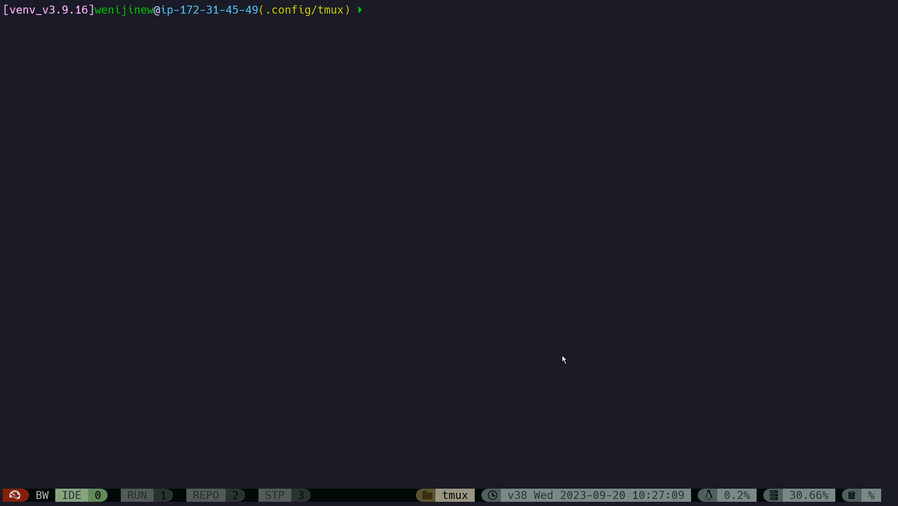
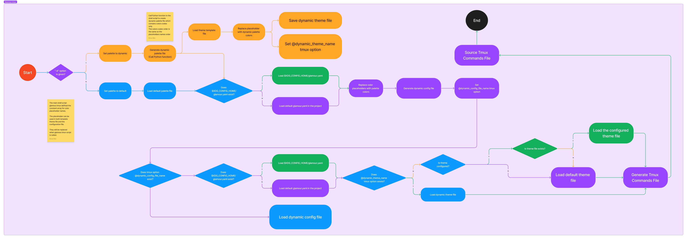

# Introduction

## What's Glamour.Tmux

Glamour.Tmux is a Tmux plugin(throught [TPM](https://github.com/tmux-plugins/tpm)). It aims to help Tmux user to simplify configurations, especially for theme configuration, customization, and *dynamic* theme generation.

## What's NOT Glamour.Tmux

Glamour.Tmux is not for Tmux layout or Tmux session management. Try [tmuxp](https://github.com/tmux-python/tmuxp) and [tmuxinator](https://github.com/tmuxinator/tmuxinator) instead.

# Demo

## Dynamic Theme

You can create new random dynamic theme and apply immediately by key `PREFEX g`. In theory, you can have unlimited dynamic theme. Note: by default, new dynamic theme will override the old one. In another word, only one dynamic theme is saved automatically.



# Installation


* Option1: Configure in `.tmux.conf` file as [TPM](https://github.com/tmux-plugins/tpm) plugin.

``` bash
set -g @plugin 'tmux-plugins/tpm'
set -g @plugin 'tmux-plugins/tmux-sensible'
set -g @plugin 'wenijinew/glamour.tmux'
```

And then run command `tmux source ~/.tmux.conf` and `PREFIX I ` to clone this repo to `~/.tmux/plugins/`

* Option2: Clone this repo by manually:

``` bash
git clone https://github.com/wenijinew/glamour.tmux.git
```

Go to glamour.tmux and run `./glamour.tmux`


# Environment Requirements

* Fonts

Glamour.Tmux can work perfectly if the morden fonts (E.g. [Nerd Fonts](https://www.nerdfonts.com/font-downloads)) are installed for the terminal. These morden fonts support different UNICODE characters which could be used as decoration for Glamour.Tmux themes.

* Python and Bash

Glamour.Tmux is developed with Python and Bash programming languages. In most cases, both are already available in your work environment. If not, please install them separately. The latset version are recommended.

* Tmux

This is nonsense. You must have Tmux installed to use Glamour.Tmux to decorate it.

* Terminal Application

Tmux is not a terminal emulator but a terminal multiplexer. To use Tmux, you have to install terminal applications in advance.
If you work on Windows, you can use Windows Terminal, PuTTY. If you work on Linux, you probably have more choices.

# User Guide

After installation, user can use bind-keys as follows for theme settings:

Note: by default, PREFIX is `C-b`.

* `PREFIX g` - Create and apply a dynamic theme. You can have *unlimited* different dynamic themes. This is the most recommended usage because you can alway have totally fresh and probably unique theme.
* `PREFIX G` - Reset to the default theme. In case you want to go back to the place where dreams begin.
* `PREFIX a` - Show all available themes. To show all themes in popup. You can apply any specific theme in command line: `glamour.tmux -t [THEME NAME]`.
* `PREFIX r` - Rotate all available themes. If you prefer to use available themes, and sometimes want to change a bit, then rotate the available themes.

To create own theme, simply copy `dynamic.theme.yaml` to the new them file. Then, do customization in the new theme file.
To set the new theme as default theme, update `$XDG_CONFIG_HOME/tmux/glamour.yaml` file to change theme name to new theme.

More bind-keys are set by default as follows:

* `PREFIX C-j` - enable synchronize-panes (typing in all panes simultaneously in current windows).
* `PREFIX C-k` - disable synchronize-panes (typing in all panes simultaneously in current windows).
* `M-Left` - select the left window. (if in the first window, then go to last window)
* `M-Right` - select the right window. (if in the last window, then go to first window)
* `M-l` - select the previous working window.
* `M-j` - go to the left pane in the same horizontal level. if no more left, then go to the last pane in the same hozontal level.
* `M-k` - go to the downward pane in the same vertial level. if no more downward pane, then go to the first pane in the same vertial level.

# Issues, New Features and Vulnerabilities

Please use [Bug Report](https://github.com/wenijinew/glamour.tmux/issues/new?assignees=&labels=&projects=&template=bug_report.md&title=) or [Feature Request](https://github.com/wenijinew/glamour.tmux/issues/new?assignees=&labels=&projects=&template=feature_request.md&title=).

## Vulnerability

Please [report vulnerability](https://github.com/wenijinew/glamour.tmux/security/advisories/new) once you noticed.

# Developer Guide

Glamour.Tmux is developed with Python and Bash programming languages.

Python modules are use to generate dynamic palette, parse configuration file and theme file, generate Tmux commands to set options and bind keys.

Bash scripts are use to accept client parameters, create dynamic configuration file or theme file, run generated Tmux commands to apply configurations and theme.

Anybody are welcome to contribute for new features or fix bugs. Before you start, please carefully read [CONTRIBUTING](CONTRIBUTING.md) and [CODE OF CONDUCT](CODE_OF_CONDUCT.md).Please make sure you respect it.

Learn more detail by reading the flow chart below:



# Thanks

Glamour.Tmux is derived from [catppuccin/tmux](https://github.com/catppuccin/tmux). Thanks all contributors and their great workk on [catppuccin/tmux](https://github.com/catppuccin/tmux).
