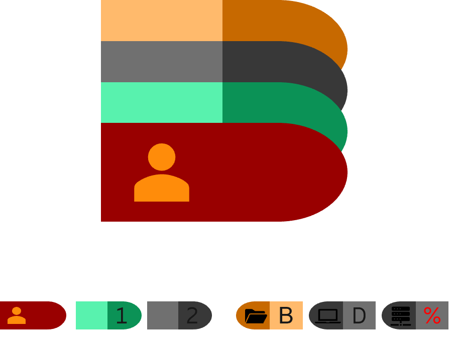
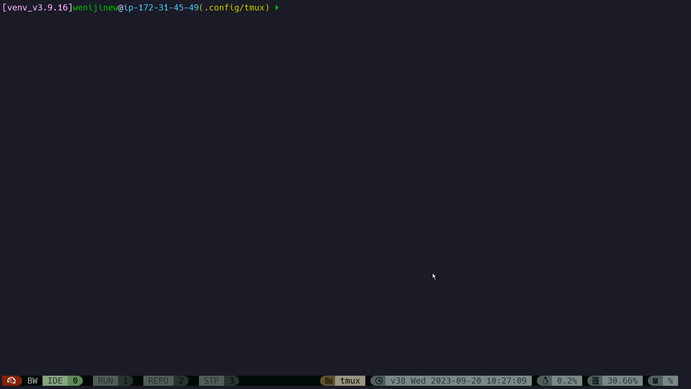
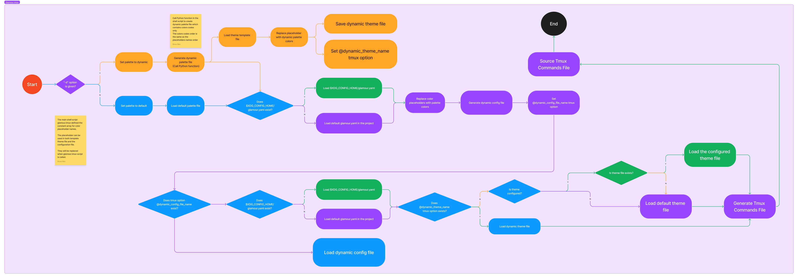

# Introduction

## What's Eutmux

Eutmux is a Tmux plugin(throught [TPM](https://github.com/tmux-plugins/tpm)). It aims to help Tmux user to simplify configurations, especially for theme configuration, customization, and *dynamic* theme generation.

## What's NOT Eutmux

Eutmux is not for Tmux layout or Tmux session management. Try [tmuxp](https://github.com/tmux-python/tmuxp) and [tmuxinator](https://github.com/tmuxinator/tmuxinator) instead.

# Demo

## Dynamic Theme Demo

You can create new random dynamic theme and apply immediately by key `PREFEX g`. In theory, you can have unlimited dynamic theme. Note: by default, new dynamic theme will override the old one. In another word, only one dynamic theme is saved automatically.



# Installation


* Option1: Configure in `.tmux.conf` file as [TPM](https://github.com/tmux-plugins/tpm) plugin.

``` bash
set -g @plugin 'tmux-plugins/tpm'
set -g @plugin 'tmux-plugins/tmux-sensible'
set -g @plugin 'wenijinew/eutmux'
```

And then run command `tmux source ~/.tmux.conf` and `PREFIX I ` to clone this repo to `~/.tmux/plugins/`

* Option2: Clone this repo by manually:

``` bash
git clone https://github.com/wenijinew/eutmux.git
```

Go to eutmux and run `./eutmux.tmux`


# Environment Requirements

* Fonts

Eutmux can work perfectly if the morden fonts (E.g. [Nerd Fonts](https://www.nerdfonts.com/font-downloads)) are installed for the terminal. These morden fonts support different UNICODE characters which could be used as decoration for Eutmux themes.

* Python and Bash

Eutmux is developed with Python and Bash programming languages. In most cases, both are already available in your work environment. If not, please install them separately. The latset version are recommended.

* Tmux

This is nonsense. You must have Tmux installed to use Eutmux to decorate it.

* Terminal Application

Tmux is not a terminal emulator but a terminal multiplexer. To use Tmux, you have to install terminal applications in advance.
If you work on Windows, you can use Windows Terminal, PuTTY. If you work on Linux, you probably have more choices.

# User Guide

After installation, user can use bind-keys as follows for theme settings:

Note: by default, PREFIX is `C-b`.

* `PREFIX g` - Create and apply a dynamic theme. You can have *unlimited* different dynamic themes. This is the most recommended usage because you can alway have totally fresh and probably unique theme.
* `PREFIX G` - Reset to the default theme. In case you want to go back to the place where dreams begin.
* `PREFIX a` - Show all available themes. To show all themes in popup. You can apply any specific theme in command line: `eutmux.tmux -t [THEME NAME]`.
* `PREFIX r` - Rotate all available themes. If you prefer to use available themes, and sometimes want to change a bit, then rotate the available themes.

To create own theme, simply copy `dynamic.theme.yaml` to the new them file. Then, do customization in the new theme file.
To set the new theme as default theme, update `$XDG_CONFIG_HOME/eutmux/eutmux.yaml` file to change theme name to new theme.

More bind-keys are set by default as follows:

* `PREFIX C-j` - enable synchronize-panes (typing in all panes simultaneously in current windows).
* `PREFIX C-k` - disable synchronize-panes (typing in all panes simultaneously in current windows).
* `M-Left` - select the left window. (if in the first window, then go to last window)
* `M-Right` - select the right window. (if in the last window, then go to first window)
* `M-l` - select the previous working window.
* `M-j` - go to the left pane in the same horizontal level. if no more left, then go to the last pane in the same hozontal level.
* `M-k` - go to the downward pane in the same vertial level. if no more downward pane, then go to the first pane in the same vertial level.

## Configuration File

After installation, the default configuration file was copied to `$XDG_CONFIG_HOME/eutmux/eutmux.yaml`. In the configuration file, user can do customization.

* _theme_: theme file name without extension(`.theme.yaml`)
* _general/options_: any kinds of Tmux options (but only those with simple values are recommended to put here). `key` is the option name, `value` is the option value. For switch options, use `true` or `false`. `on` or `off`, "on" or "off" are all supported.
* _general/styles_: Tmux options ending with `_style` such as `message-style`. Mainly for `fg`, `bg` and `style` settings.
* _general/commands_: general Tmux commands but mainly for `bind-keys`.
* _status_left_: a list of one or more supported Tmux [FORMATS](https://man7.org/linux/man-pages/man1/tmux.1.html#FORMATS) could be configured here. Each of them is a `dict`: `key` is name, `value` is a `dict` whose `key` is one of the supported keys: `enabled`, `format`, `icon`, `decorator`, `fg_format`, `bg_format`, `fg_icon`, `bg_icon`, `fg_decorator`, `bg_decorator` and `style`. _Note_: `icon` and `decorator` are UNICODE charactors which represents graphs . By default, `enabled` is `true`, `format` is empty. _Other keys_ are optional and the ones in *theme* file will be used if not configured in the configuration file (if they are configured in configuration file, they have higher priority - will overrides the ones from *theme* file). Value of `fg_***` and `bg_***` could be HEX value such as `#ff0efa` (lower case) or [Color Identity](#color-identity) such as `C_1_2`.
* _window_: includes 2 sections: `active` and `inactive` for current window and other windows. Both supports keys `window_name`, `window_index`, and all keys supported by `status-left`.
* _status_right_: same with `status-left` but for right side of the status line. By default, except for current directory name and date time, `CPU`, `Memory`, and `Desk` usage are displayed on _status_right_. Those 3 parts are handled by bash scripts: [cpu.sh](cpu.sh), [memory.sh](memory.sh), [disk.sh](disk.sh). User can add more similar components by adding similar shell script file under `$XDG_CONFIG_HOME/eutmux/`.

## Theme File

Theme file is to decouple _icon_, _decorator_, _style_ and _color_ configurations from the main configuration file. Refer to the [Template Theme File](template.theme.yaml) for details. The [Template Theme File](template.theme.yaml) is mainly used for [Dynamic Theme](#dynamic-theme) generation. All color values in the [Template Theme File](template.theme.yaml) are [Color Identity](#color-identity) such as `C_1_3` which will be replaced with specific color HEX value such as `#ff7834` when [Dynamic Theme](#dynamic-theme) is generated. Therefore, in generated [Dynamic Theme](#dynamic-theme) file, all color values are HEX value and not color identity anymore.


### Dynamic Theme

Dynamic theme relies on [RGB](https://en.wikipedia.org/wiki/RGB_color_model), [Hue](https://en.wikipedia.org/wiki/Hue), [HLS](https://en.wikipedia.org/wiki/HSL_color_space) and [Color Scheme](https://en.wikipedia.org/wiki/Color_scheme) technologies. Simply, use one random [RGB](https://en.wikipedia.org/wiki/RGB_color_model) color and then find out `n` other colors with 360 degrees. For example, if `n` is 3, then other 2 colors are from `120` and `240` degrees of [Hue](https://en.wikipedia.org/wiki/Hue). These colors are called _base colors_. Once _base colors_ are generated, _light colors_ are generated.

By default, dynamic theme uses `6` different random _base color_ sets. One of them is `dark` color set which is used for status-line `bg`. Other `5` colors are for status-line components `bg` and `fg`. The _light color_ total is `5` by default. Therefore, each dynamic theme consists of `36` different colors - `6` _base color_ and `30` _light color_. However, in [Template Theme File](template.theme.yaml) for details, only `11` of them are used by default. To make the status-line more colors, user can make tuning in [Template Theme File](template.theme.yaml) for details.

Dynamic colors are generated and saved in palette file - _dynamic_palette.txt_. The conent of palette file follows the format: `[color identity]=[color hex code]` such as `C_5_4:#685255`.

The total number of _base color_ and _light color_ are configurable with customized Tmux options `@eutmux_base_color_total` and `@eutmux_light_color_total` respectively.

_Note_: till now, dynamic theme only work for _color_ of the themes not for _icon_, _decorator_, and _style_. In another word, only _color_ could be dynamic. I don't see the need of dynamic theme for _icon_, _decorator_, and _style_ yet.

### Color Identity

Color identity plays the place holder role. When dynmamic theme is generated, all color identities are replaced with concrete color HEX codes.

Value of each color identity follows the format `C_[base color index]_[light color index]`. _Base color_ index starts from `1` and _light color_ index starts from `0` (lightest). So, by default, the color identities are from `C_1_0` to `C_6_5`.
Note, here, _base color_ in _base color index_ should be understood as group of the colors rather than the concrete color HEX codes which are all from _light color_ which includes both _base color_ and _light color_. (A bit confusing but I need more time to think about the better names to easily distinguish them.)

Color identity could be used in [Configuration File](#configuration-file) also. In fact, _Eutmux_ always generates dynamic configuration file by replacing color identities with color codes from palette file.

## Report

* [Bug](https://github.com/wenijinew/eutmux/issues/new?assignees=&labels=&projects=&template=bug_report.md&title=)
* [Feature](https://github.com/wenijinew/eutmux/issues/new?assignees=&labels=&projects=&template=feature_request.md&title=)
* [Vulnerability](https://github.com/wenijinew/eutmux/security/advisories/new)

# Developer Guide

Eutmux is developed with Python and Bash programming languages.

Python modules are use to generate dynamic palette, parse configuration file and theme file, generate Tmux commands to set options and bind keys.

* [eutmux.py](eutmux.py)
* [palette.py](palette.py)

Bash scripts are use to accept client parameters, create dynamic configuration file or theme file, run generated Tmux commands to apply configurations and theme.

* [eutmux.tmux](eutmux.tmux)

Anybody are welcome to contribute for new features or fix bugs. Before you start, please carefully read [CONTRIBUTING](CONTRIBUTING.md) and [CODE OF CONDUCT](CODE_OF_CONDUCT.md).Please make sure you respect it.

Learn more detail by reading the flow chart below:



# Thanks

Eutmux is derived from [catppuccin/tmux](https://github.com/catppuccin/tmux). Thanks all contributors and their great work on [catppuccin/tmux](https://github.com/catppuccin/tmux).
